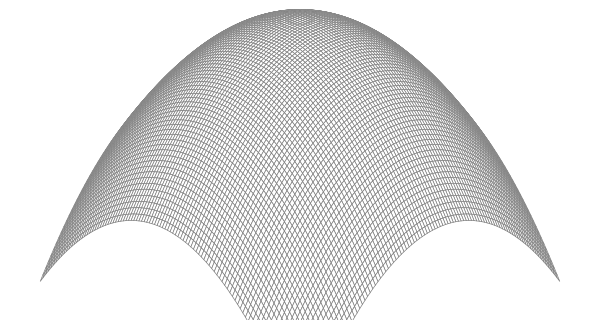

# ch03/ex02

## saddle point

```go
package main

const (
	xyrange = 30.0 // range (-xyrange..+xyrange)
)

func saddlePoint(x float64, y float64) float64 {
	r := x*x - y*y
	return r / (xyrange * xyrange)
}
```


## egg point

```go
package main

import "math"

const (
	xyrange = 30.0 // range (-xyrange..+xyrange)
)

func eggPoint(x float64, y float64) float64 {
	r := x*x + y*y
	return -r/math.Pow(xyrange, 1.6) + 1
}
```


